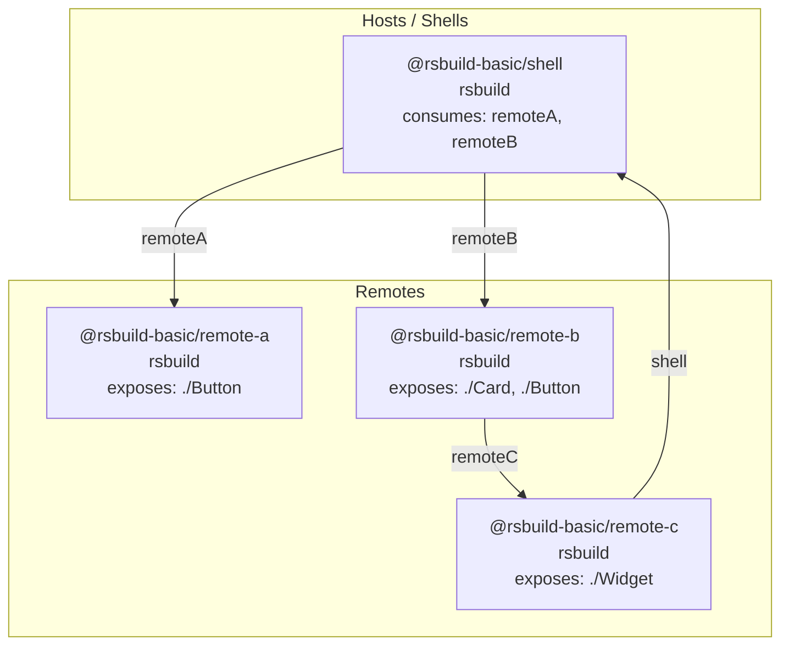

# mf-doctor graph

Visualize the federation topology as ASCII art or a Mermaid diagram.

## ASCII output

**Command:**

```bash
npx mf-doctor graph examples/rsbuild-basic
```

**Output:**

```
Module Federation Topology
══════════════════════════════════════════════════

Hosts / Shells
──────────────────────────────
  ┌────────────────────────────────────┐
  │ @rsbuild-basic/shell HOST [rsbuild]│
  │ consumes: remoteA, remoteB        │
  └────────────────────────────────────┘
  │
  ├──▶ @rsbuild-basic/remote-a as remoteA
  └──▶ @rsbuild-basic/remote-b as remoteB

Remotes
──────────────────────────────
  ┌────────────────────────────────────┐
  │ @rsbuild-basic/remote-a REMOTE     │
  │ [rsbuild]                         │
  │ exposes: ./Button                  │
  └────────────────────────────────────┘
  consumed by: @rsbuild-basic/shell

  ┌────────────────────────────────────┐
  │ @rsbuild-basic/remote-b REMOTE     │
  │ [rsbuild]                         │
  │ exposes: ./Card, ./Button         │
  │ consumes: remoteC                 │
  └────────────────────────────────────┘
  │
  └──▶ @rsbuild-basic/remote-c as remoteC
  consumed by: @rsbuild-basic/shell

  ┌────────────────────────────────────┐
  │ @rsbuild-basic/remote-c REMOTE     │
  │ [rsbuild]                         │
  │ exposes: ./Widget                  │
  │ consumes: shell                   │
  └────────────────────────────────────┘
  consumed by: @rsbuild-basic/remote-b

──────────────────────────────────────────────────
Total: 4 participants, 4 edges
```

## Mermaid diagram

**Command:**

```bash
npx mf-doctor graph examples/rsbuild-basic -f mermaid -o topology.mmd
```

The Mermaid output can be converted to an image using [@mermaid-js/mermaid-cli](https://www.npmjs.com/package/@mermaid-js/mermaid-cli):

```bash
npx @mermaid-js/mermaid-cli -i topology.mmd -o topology.svg -b transparent
```

**Example output (rsbuild-basic topology):**


<details>
<summary>Mermaid source (topology.mmd)</summary>



</details>

## What this demonstrates

- **ASCII topology**: Hosts and remotes with consume/expose relationships
- **Mermaid diagram**: Export for docs, ADRs, or architecture diagrams
