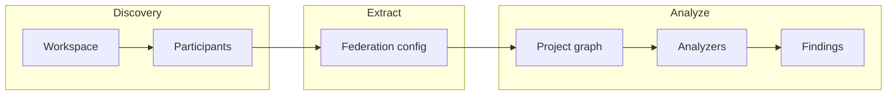

# Introduction

**mf-doctor** is a static analyzer for Module Federation setups. It discovers federation participants, extracts config from your bundler, and runs checks to catch version drift, shared-config mismatches, and other issues before they hit production.

## What it does

- **Discovers** federation participants (shell + remotes) in the workspace
- **Extracts** Module Federation config from bundler configs (rsbuild, rspack, webpack)
- **Runs analyzers** and reports:
  - React version drift (uses resolved versions from lockfile when present for accuracy)
  - Shared config mismatches
  - Missing shared dependencies
  - Duplicate expose names
  - Orphan exposes
  - Circular dependencies
  - Shared dependency candidates
- **Output:** human-friendly CLI and/or JSON for CI

## Problems it addresses

- **Version drift** — Shell and remotes on different React (or other shared) versions lead to duplicated bundles, hook issues, and subtle bugs.
- **Inconsistent shared config** — Same package with different `singleton`, `requiredVersion`, or `eager` across participants causes unpredictable resolution. Incompatible `requiredVersion` ranges (no overlapping version) are reported as HIGH; different but compatible ranges as MEDIUM.
- **Low visibility** — Hard to see which apps participate, what they expose, and who consumes whom.
- **Config opacity** — Values hidden behind helpers, spreads, or env logic; "dev server starts" is not a guarantee.

:::tip Lockfile accuracy
When a lockfile (`package-lock.json`, `pnpm-lock.yaml`, or `yarn.lock`) is present, version drift and the shared-deps matrix use **resolved** versions for greater accuracy than package.json ranges alone.
:::

## Design

- **Bundler-agnostic core** — Core works on a normalized config representation; rsbuild/rspack/webpack support is via extractors.
- **Static, best-effort parsing** — Config files are parsed as TS/JS; highly dynamic configs are flagged as partially analyzable.
- **Composable analyzers** — Each check is a pure function; easy to extend.

## Pipeline overview

Mermaid source

Next: [Installation](/docs/getting-started/installation) or [Quick Start](/docs/getting-started/quick-start).

See also: [Showcases](/docs/guides/showcases) — see mf-doctor in action on sample workspaces.
